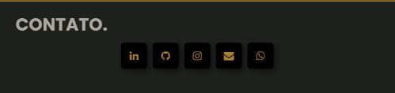

# Portfolio

## Bem-vindo ao meu site portfolio! Desenvolvido com HTML, CSS e JavaScript. Este espaço foi criado para apresentar meus projetos e habilidades. Aqui, você encontrará uma seleção de alguns de meus projetos, que demonstram meu compromisso com a evolução contínua e dedicação.

---

 
 
 

## Introdução

# A seção de introdução/apresentação deste site apresenta uma animação criativa nas frases de apresentação, além de um background animado e um menu com rolagem lateral. Detalhes que proporcionam um toque diferenciado.

---

 
 
 

## Sobre Mim

# A seção "Sobre Mim" deste site apresenta um design criativo, com destaque para dois pseudoelementos no fundo do texto, animados com keyframes. O efeito de transparência com blur no background do texto é um detalhe diferenciado que valoriza a apresentação.

---

 
 
 

## Habilidades

# A seção de habilidades deste site apresenta uma lista dinâmica de tecnologias que, ao serem selecionadas, abrem uma nova aba com informações detalhadas dos certificados da tecnologia escolhida. Descubra mais sobre minhas habilidades e certificações nesta seção interativa.

---

 
 
 

## Projetos

# A seção de projetos apresenta uma lista de projetos que foram desenvolvidos durante o seu aprendizado até o momento, organizados em forma de cards de slides. Cada card contém informações sobre o projeto, como seu nome, descrição e link para acesso.

---

 
 
 

## Contatos

#A seção de contato contém uma lista de contatos e redes sociais para me comunicar e manter contato com você.

---

 
 
 

## Contatos

# O projeto é totalmente responsivo, ou seja, adapta-se a diferentes tamanhos de tela e dispositivos sem perder qualidade.

---

 
 
 

